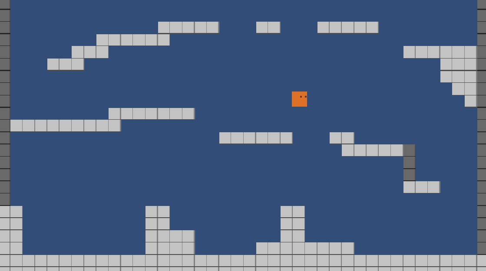
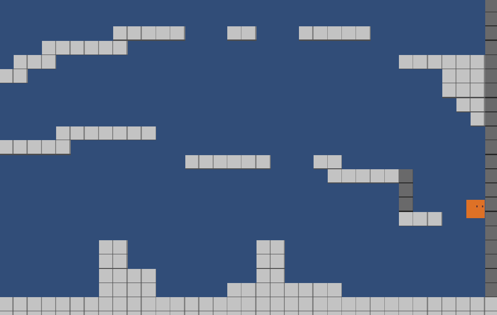

# 2D-Player-Controller
C# player controller for 2D platformer in Unity.

# Features

It includes:

- Jump
- Wall jump
- Wall slide
- 8-directional dash

  
  &nbsp;&nbsp;&nbsp;
    

# Code

Complete [C# code](code) for the current prototype.

# Documents

[QA Sample](docs) of a bug report during development.
